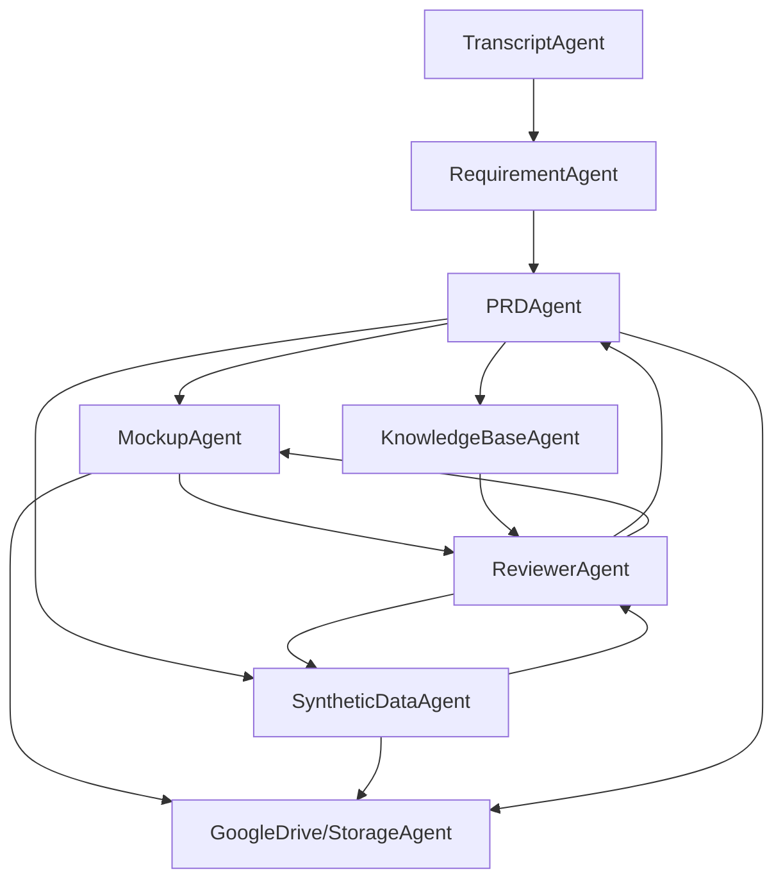

# **Product Requirements Document – Multi-Agent AICOE Automation Platform**

**Version:** 1.0  
**Date:** October 29, 2025  
**Prepared For:** AICOE Engineering & Product Team  
**Target Audience:** AI Developers, Product Managers, Solution Architects, UX Designers

***

## **1. Executive Summary**

The AICOE Automation Platform enables rapid (under 30 minutes), secure transformation of raw meeting transcripts into complete enterprise-grade deliverables—structured notes, use cases, synthetic data, PRDs, and Apple-style HTML/JS mockups. Each process step is handled by a dedicated agent orchestrated through Google ADK, adhering strictly to your templates, branding, design, and security guidelines. All files are stored and managed across a project-centric folder structure (prototype → HTML → versioned docs), with Google Drive integration, audit trails, version control, and enterprise compliance.

***

## **2. Goals & Objectives**

- **Automate discovery-to-deliverable workflow with minimal manual intervention**
- **Deliver client-ready documentation and prototypes in <30 minutes per recorded meeting**
- **Strictly enforce company branding, approved templates, and security/privacy protocols**
- **Enable team collaboration, reviewer feedback, and iterative improvement**
- **Support future extensibility for new domains, compliance needs, and agent capabilities**

***

## **3. Features & User Stories**

### **Multi-Agent Orchestration**

| Agent/Module      | Description                                                  | Output             |
|-------------------|-------------------------------------------------------------|---------------------|
| Transcript Agent  | Ingest meeting audio/text, transcribe, extract notes, structure findings | Structured notes, action items   |
| Requirement Agent | Generate company/meeting overview, use cases, key requirements (using AICOE-supplied templates) | Use case matrix, business spec   |
| PRD Agent         | Assemble use cases + additional requirements into PRD format (per AICOE template with branding) | Complete PRD (HTML, PDF, JSON)   |
| Mockup Agent      | Produce AICOE-branded HTML/JS interactive prototypes: deep navy backgrounds, white text, bright blue accents, Lucid icons, Apple-style responsive design | Navigable mockup suite           |
| Synthetic Data Agent | Generate realistic demo data matching AICOE use case specifications and branding requirements | Sample CSV/JSON/structured data  |
| Knowledge Base Agent | Enrich all document generation using AICOE domain knowledge, AI design patterns, compliance rules (ChromaDB semantic search) | Contextual suggestions/augmentation|
| Reviewer Agent    | Support reviewer feedback loops with AICOE-branded dashboard: annotation, accept/reject, regeneration cycle | Versioned feedback history       |
| Collaboration/Storage Agent | Auto-organize project folder, save to Google Drive, enforce AICOE access/roles and branding consistency | Folder tree, version history, access logs |

***

### **End-to-End Workflow (From Srinivas’s Reference)**

1. **Transcript Ingestion:** Place transcript in project folder & upload into system.
2. **Structured Notes Extraction:** System uses AI to extract actionable meeting summary and triggers use case identification.
3. **Use Case Generation:** Use supplied company template to structure detailed use cases (e.g., decision support, vendor selection, contract validation).
4. **Synthetic Data Generation:** AI creates realistic demo data for mockups.
5. **Mockup Generation:** System generates HTML files with strict AICOE visual identity (deep navy backgrounds, white text, bright blue accents, Lucid icons, Apple-style responsive design), versioned under HTML/Version1 in folder.
6. **PRD Generation:** AI compiles a PRD per supplied template.
7. **System Architecture Doc:** Generate diagram showing technical flow and integrations (sample: JD Edwards, Boomi).
8. **Version Control:** All outputs stored in correct folder hierarchy with auto-versioning.
9. **Reviewer Workflow:** Reviewer agent dashboard for feedback, annotation, approval/regeneration cycles.
10. **Secure Data Management:** Enforced by process—no third-party untrusted endpoint, only Google Drive API or local/secure backend storage.

***

### **Design & Data Security Guidelines (AICOE Brand Standards)**

- **UI/Visual Identity:** 
  - **Colors:** Deep navy blue backgrounds, white/off-white primary text, light gray secondary text
  - **Accents:** Bright blue/cyan/teal for links, hover states, buttons, and interactive elements
  - **Typography:** Clean sans-serif (geometric/neo-grotesque), bold hero titles, medium headers, regular body text
  - **Icons:** Lucid icons in white/accent colors, consistent sizing and professional spacing
  - **Layout:** Apple-style clean/minimalist, high-contrast design, responsive across all devices
- **Interactive Elements:**
  - **Buttons:** Outlined white borders, white text, accent fill on hover/active states
  - **Navigation:** White text, AICOE logo in white, evenly spaced professional layout
  - **Cards/Sections:** Dark blue variations, subtle borders, all-caps headers with letter spacing
- **Templates:** All agents use provided document and mockup templates with strict AICOE brand compliance
- **Security:** No unapproved external sites; process only through Claude, Gemini, or internal backend; all files locally/on Google Drive (with audit)
- **Project Structure:** Prototype folder (project root) → HTML/versioned → meeting notes, use cases, PRD, synthetic data subfolders
- **PDF Export:** System supports automated HTML → PDF conversion (fallback to Puppeteer, WeasyPrint, or Gemini HTML2PDF if needed)
- **Audit & Compliance:** All uploads, downloads, edits, feedback tracked per user ID

***

## **4. Functional Requirements**

### **Transcript Agent**
- FR-01: Accepts file uploads (.txt, .docx, .pdf, audio)
- FR-02: Runs transcription (if audio) using approved AI models
- FR-03: Structures notes: company profile, attendees, objectives, discussion points

### **Requirements Agent**
- FR-04: Parses notes, applies company templates for business requirements, pain points, technical constraints
- FR-05: Generates use case matrix per provided template

### **PRD Agent**
- FR-06: Assembles PRD with AICOE branding (overview, business goals, project scope, requirements, user stories, use cases, technical constraints, acceptance criteria, risk analysis)
- FR-07: Exports PRD in HTML, PDF, and JSON using AICOE templates and visual identity (dark theme, white text, professional typography)

### **Mockup Agent**
- FR-08: Generates interactive HTML/JS mockups per use case with strict AICOE brand compliance:
    - **Color Palette:** Deep navy blue/dark blue backgrounds, white/off-white primary text, light gray secondary text
    - **Accent Colors:** Bright blue/cyan/teal for links, hover states, and interactive elements
    - **Typography:** Clean sans-serif font stack, geometric/neo-grotesque style, proper font weights (bold 600-700 for heroes, medium for headers, regular 400 for body)
    - **Lucid Icons:** White/accent color treatment, consistent sizing and professional spacing
    - **Apple-style Navigation:** Clean/minimalist hierarchy, high-contrast design
    - **Responsive Design:** Maintains dark theme across all screen sizes (mobile, tablet, desktop)
    - **Interactive Elements:** Outlined white borders for buttons, accent fill on hover, professional spacing
- FR-09: Creates AICOE-branded index page linking all mockups/screens with consistent navigation and logo placement
- FR-10: Supports download and Google Drive sync with proper AICOE folder structure and branding

### **Synthetic Data Agent**
- FR-11: Creates realistic demo data sets (CSV/JSON) per AICOE use case requirements for visualization and mockup demos, ensuring data supports AICOE branding scenarios
- FR-12: Validates schema compliance and enrichment from AICOE Knowledge Base patterns

### **Knowledge Base Agent**
- FR-13: Runs ChromaDB/Vertex Matching for vector search/contextual suggestions specific to AICOE domain expertise and branding requirements
- FR-14: Surfaces relevant AICOE domain patterns, regulatory best practices, compliance rules, sample integration flows, and ensures all suggestions maintain brand consistency

### **Reviewer Agent**
- FR-15: Presents full feedback dashboard with AICOE branding (deep navy theme, white text, professional layout) for team annotation, versioning, approval
- FR-16: Supports review cycles within AICOE-branded interface: accept/reject/suggest with consistent visual identity
- FR-17: Triggers re-generation of document or mockup with accepted feedback while maintaining AICOE brand standards
- FR-18: Tracks feedback cycle history with timestamp/user attribution in AICOE-branded dashboard

### **Collaboration & Storage**
- FR-19: Connects to Google Drive API to create/maintain project folders with AICOE branding and naming conventions
- FR-20: Stores artifacts in correct tree structure with auto-versioning and AICOE brand consistency across all files
- FR-21: Enforces role-based access, security policies, and logs activity with AICOE compliance standards

***

## **5. Technical Architecture**

| Layer       | Tech             | Role/Functionality                       |
|-------------|------------------|------------------------------------------|
| Orchestration| Google ADK      | Multi-agent workflow, error handling     |
| LLM         | Gemini/Claude    | Content generation, summarization        |
| Storage     | Google Drive     | Artifact/project file management         |
| DB          | ChromaDB/Postgres| KB patterns/artefact metadata            |
| Backend API | FastAPI/Python   | REST endpoints, workflow triggering      |
| Frontend    | Next.js/React    | UI, upload, feedback, artifact preview   |
| PDF Export  | Puppeteer/WeasyPrint| HTML→PDF conversion, fallback          |
| Security    | OAuth/IAM/AES/TLS| Auth, data protection, compliance        |

***

## **6. Workflow Diagram**


- Each agent acts as a plug-and-play module, accepting specific inputs, applying templates, generating outputs, updating correct folder structure.

***

## **7. Acceptance Criteria**

- End-to-end pipeline—from upload to deliverables—in <30 min per project
- All outputs strictly match provided templates, company branding, and document standards
- HTML mockups follow Apple-style, Lucid icon guidelines, and are printer-friendly
- Google Drive integration works for all roles: designer, reviewer, client
- Reviewer dashboard supports annotation, feedback, and triggers at least 3 full cycles of artifact regeneration per project
- Audit logs and security events tracked and reviewable per project/team/user

***

## **8. Non-Functional Requirements**

- Responsive UI: supports desktop/mobile, major browsers
- Modular: Each agent/service containerized (Docker), independently deployed/updated
- API versioning, health checks, rollback support for ADK workflows
- 30-day backup retention; automated audit export for compliance

***

## **9. Risks & Mitigation**

| Risk                       | Mitigation                                         |
|----------------------------|----------------------------------------------------|
| LLM token/size limits      | Chunking, fallback libraries, batch processing     |
| Review/iteration not tracked| Strict versioning, dashboard logs                 |
| File leakage/data breach   | Strict IAM, encrypted storage, local-only API keys |
| PDF conversion failures    | Multiple engine fallback (Gemini, Puppeteer, WeasyPrint)|
| Domain patterns missing    | Continuous KB enrichment, human-in-the-loop feedback|

***

## **10. Project Folder Structure**

```
/PrototypeProject/
    /MeetingTranscripts/
    /MeetingNotes/
    /UseCases/
    /SyntheticData/
    /HTML/Version1/
        /Mockups/
        index.html
    /PRDDocuments/
        PRD_v1.html
        PRD_v1.pdf
    /SystemArchitecture/
    /ReviewerFeedback/
    /AuditLogs/
```
- All outputs stored locally and/or synced to Google Drive

***

## **11. Glossary**

- **Agent:** Self-contained process module (Google ADK)
- **Artifact:** Output document (notes, PRD, mockup, etc.)
- **PRD:** Product Requirements Document
- **Knowledge Base (KB):** Context enrichment, gap analysis (ChromaDB)
- **Mockup:** HTML/JS demo of the solution
- **Reviewer Feedback:** System for collaborative improvement and validation

***

## **12. Roadmap**

| Timeline | Milestone                                    |
|----------|----------------------------------------------|
| Day 1-7  | ADK agent definitions, transcript workflow   |
| Day 8-14 | Requirements, PRD, KB agent, mockup templates|
| Day 15-21| Mockup, synthetic data, reviewer dashboard   |
| Day 22-28| API, frontend, Google Drive integration      |
| Day 29-30| Testing, documentation, internal launch      |

***

**This PRD is your actionable blueprint!** Define your agents exactly as above, enforce your templates and branding, use ADK for orchestration and separation of logic, and build secure, scalable, client-ready automation for enterprise use.  
If you want exact agent starter code, template definitions, or workflow configs, let me know!


Absolutely. Here is a **very detailed, comprehensive PRD** for your Multi-Agent AICOE Automation Platform. This covers every technical, business, design, workflow, and security detail based on all your requirements, discussions, Srinivas’s reference process, and the Google ADK multi-agent architecture.

***

# **Product Requirements Document (PRD): AICOE Multi-Agent Automation Platform**

**Version:** 1.0  
**Date:** October 29, 2025  
**Prepared For:** AICOE Engineering & Product Teams  
**Target Audience:** AI Developers, Product/Project Managers, Solution Architects, Designers, Security Leads  
**Classification:** Internal - Confidential

***

## **1. Executive Summary**

Build an AI-powered, agentic automation platform to convert client meeting transcripts into complete, enterprise-grade product artifacts — structured notes, use cases, synthetic data, PRDs, HTML/JS mockups, and architecture diagrams — all within 30 minutes. The platform orchestrates specialized agents, each following AICOE’s exact templates and branding, leveraging Google ADK for workflow control, and ensures strict data privacy, role management, and project structure.

***

## **2. Goals and Objectives**

- **Accelerate AI prototyping:** Replace weeks of manual work with an end-to-end 30-minute automated process.
- **Enforce consistency:** Every output adheres to AICOE branding, templates, format guidelines (ex: Apple-style mockups, Lucid icons).
- **Maintain data security:** Never let unapproved data exit controlled APIs/systems.
- **Enable collaboration:** Multiple roles (designer, reviewer, client) with project-based file/folder organization and feedback/iteration.
- **Build for extensibility:** Add industries/domains, use-case types, compliance frameworks, and workflow agents easily.

***

## **3. Target Users & Roles**

- **Designer:** Uploads transcripts, reviews agent output, initiates workflows.
- **Product Manager:** Oversees PRD/use case quality, manages iteration cycles.
- **Reviewer:** Annotates, accepts/rejects outputs, triggers regeneration cycles.
- **Client:** Receives secure, branded deliverables for demos/approval.
- **Admin:** Manages users, project access, audit logs, compliance snapshots.

***

## **4. Document, Branding & Data Security Standards**

**Document Structure:**
- Use company-supplied templates for all artifacts.
- Strict AICOE visual identity for mockups: deep navy/dark blue backgrounds, white text hierarchy, bright blue/cyan accents.
- Apple-style clean/minimalist design with Lucid icons, responsive across all devices, printer-friendly HTML/CSS.
- Every agent must enrich/complete documents using knowledge base (domain patterns, regulations, integration blueprints).

**Data Security:**
- Never process confidential data on unapproved third-party services.
- Only use models/LLMs via controlled endpoints (ex: Claude, Gemini; review token storage).
- Store all output files securely on Google Drive or locally.
- All file/artifact access, edits, exports, feedback logged per project/user/action.

***

## **5. Core Functional Requirements (FR)**

### **5.1 Multi-Agent Workflow Architecture**

| Agent/Module         | Responsibility                                                                            | Accepts                   | Produces                     |
|----------------------|-------------------------------------------------------------------------------------------|---------------------------|------------------------------|
| TranscriptAgent      | Ingests transcript (file/text), transcribes audio, extracts structured notes/summary.      | Upload (txt, doc, pdf, mp3/wav) | Structured JSON notes        |
| RequirementAgent     | Extracts company, objectives, pain points, generates detailed use cases, applies template. | Structured notes, KB data | Use case matrix, features    |
| PRDAgent             | Compiles inputs into full PRD (overview, reqs, user stories, risk, diagrams); validates completeness. | Use cases, requirements    | PRD (HTML, PDF, JSON)        |
| MockupAgent          | Produces interactive, AICOE-branded HTML/JS mockups (deep navy backgrounds, white text, bright blue accents, Lucid icons, Apple-style responsive design). | PRD/use cases, synthetic data | HTML/JS files, index page   |
| SyntheticDataAgent   | Creates realistic sample datasets per use case for demo/mockup; validates against input schema/KBase. | Use cases, KB patterns     | CSV, JSON, schema files      |
| KnowledgeBaseAgent   | Supplies enrichment (domain/industry patterns, regulatory rules, design integration tips) using vector similarity search. | Any agent | Contextual edits/augmentation|
| ReviewerAgent        | Aggregates annotation/feedback per artifact; triggers regeneration for approved changes; shows iteration history. | Artifact IDs, feedback     | Versioned artifacts, dashboard|
| CollaborationAgent   | Handles Google Drive integration and project structuring, role enforcement & access logs.  | Project metadata, artifact files| Project folders, access info|

***

### **5.2 Workflow/Folder Structure**

- **PrototypeProject/**
  - **MeetingTranscripts/**
  - **MeetingNotes/**
  - **UseCases/**
  - **SyntheticData/**
  - **HTML/Version1/Mockups/**
  - **PRDDocuments/**
  - **SystemArchitecture/**
  - **ReviewerFeedback/**
  - **AuditLogs/**
- All outputs auto-versioned (ex: PRD_v1.html, PRD_v2.pdf).

***

### **5.3 Feature Details & Acceptance Criteria**

#### A. **Pipeline Orchestration**
- **Workflow must run in ≤30 min per project; each agent logs progress & errors (FR-01)**
- **Agents support sequential/parallel/hybrid execution (FR-02)**
- **Each agent has test cases for edge conditions, max file size (FR-03)**

#### B. **Input, Extraction, & Structuring**
- **Accept audio/text upload; valid file size ≤100 MB (FR-04)**
- **Audio: Auto-transcribe (Whisper/Gemini/Claude acceptable, privacy required) (FR-05)**
- **Text: Parse and structure as JSON, capturing company info, attendees, action items, constraints, requirements (FR-06)**
- **If transcript missing key section, agent requests clarification (FR-07)**

#### C. **PRD, Use Case, and Document Generation**
- **All PRD/use case output must use provided company templates rigorously (FR-08)**
- **PRD: Must contain executive summary, overview, use cases, technical/functional requirements, constraints, acceptance criteria, risk/compliance, diagrams (FR-09)**
- **PDF/HTML/JSON export required. All docs must be downloadable, directly viewable, and traceable to transcript (FR-10)**

#### D. **Mockup Generation & AICOE Brand Standards**
- **Apple-style HTML/JS with strict AICOE visual identity (FR-11):**
  - **Color Palette:** Deep navy blue/dark blue backgrounds, white/off-white primary text, light gray secondary text
  - **Accent Colors:** Bright blue/cyan/teal for links, hover states, and interactive elements
  - **Typography:** Clean sans-serif font stack, geometric/neo-grotesque style throughout
  - **Font Weights:** Bold (600-700) for hero titles, medium weight for headers, regular (400) for body text
  - **Lucid icons:** White/accent color treatment, consistent sizing and spacing
- **Interactive Elements & Responsive Design (FR-12):**
  - **Buttons:** Outlined white/light border style, white text; accent color fill on hover
  - **Navigation:** White text, evenly spaced links, AICOE logo in white
  - **Cards/Sections:** Dark blue variations for separation, subtle borders, high contrast
  - **Responsive:** Maintains dark theme across all screen sizes (mobile, tablet, desktop)
- **Technical Implementation (FR-13):**
  - **CSS:** Printer-friendly, no external dependencies except approved icon/font CDNs
  - **Layout:** Apple-style clean/minimalist hierarchy, all-caps section headers with spaced lettering
  - **Index Page:** Links all mockup screens with AICOE branding consistency
- **Content Standards (FR-14):**
  - **Mockups:** Demonstrate AI workflows with realistic AICOE-branded interfaces
  - **Navigation:** Include modals, dropdowns, and relevant user actions in AICOE style
  - **Branding:** AICOE logo placement, color consistency, professional tech aesthetic throughout

#### E. **Synthetic Data**
- **Auto-generate schema-valid CSV/JSON rows indicative of live system (FR-15)**
- **Must match use case requirements and support mockup demo (FR-16)**

#### F. **Knowledge Base Integration**
- **KB agent must apply AI/industry patterns, regulatory warnings, CRM/ERP integration advice automatically (FR-17)**
- **ChromaDB or Vertex AI Matching used for similarity/context search (FR-18)**
- **Every artifact receives KB provenance annotation (FR-19)**

#### G. **Feedback, Iteration, Review**
- **Review UI: Enables annotation, in-line comments on docs/mockups, batch accept/reject (FR-20)**
- **Version log in reviewer dashboard, all iterations recoverable (FR-21)**
- **Accepted feedback triggers regeneration; rejected change returns rationale (FR-22)**
- **Feedback sign-off triggers project ready for client delivery flag (FR-23)**

#### H. **Collaboration, Access, Compliance**
- **Google Drive API integration—creates secure folders, synchronizes all artifact updates (FR-24)**
- **Role-based access; supports designer, reviewer, client roles, access audit logs (FR-25)**
- **AES-256 for storage, TLS 1.3 for transfer, OAuth for login, GDPR data deletion flows (FR-26/27/28)**
- **30-day backup retention, automated export for compliance audit (FR-29)**

#### I. **APIs & DevOps**
- **FastAPI endpoints for all major actions (FR-30)**
- **Docker-compose config for local/on-prem/cloud launch (FR-31)**
- **All agents/tools unit/integration tested; CI/CD required (FR-32)**
- **Health check, blue/green deploy, full observability/monitoring/loglevel config (FR-33)**

***

## **6. Technical Stack**

| Layer             | Component        | Details                          |
|-------------------|-----------------|----------------------------------|
| Orchestration     | Google ADK      | Agent workflow, error control    |
| LLM               | Gemini/Claude   | Content generation               |
| Backend           | FastAPI/Python  | API, workflow trigger            |
| Storage           | Google Drive, ChromaDB, Postgres | File/artifact management, KB   |
| Frontend          | Next.js/React   | Upload, feedback, artifact UI    |
| Containerization  | Docker/K8s      | Deployment, scaling, testability |
| DevOps            | Github Actions, GCP Cloud Run    | CI/CD, auto-backup, deployment |
| Security          | OAuth2, IAM     | Role/access, data protection     |

***

## **7. Example APIs**

| Endpoint                      | Method | Description         |
|-------------------------------|--------|---------------------|
| `/api/upload_transcript`      | POST   | Upload transcript   |
| `/api/get_prd/{project_id}`   | GET    | Download PRD        |
| `/api/get_mockup/{project_id}`| GET    | Download mockup     |
| `/api/feedback/{artifact_id}` | POST   | Annotate/approve    |
| `/api/kb/query`               | POST   | Pattern search      |
| `/api/export/{project_id}`    | GET    | Export ZIP/all docs |
| `/api/health`                 | GET    | Health check        |

***

## **8. Acceptance Criteria**

- Full pipeline, from upload to client-ready PDF/HTML delivery, completes in <30 minutes, using only approved templates/branding.
- Mockups visually match AICOE brand standards: deep navy backgrounds, white text hierarchy, bright blue accents, Lucid icons, Apple-style responsive design.
- All output securely stored in Google Drive and organized in correct versioned project folder.
- Reviewer cycles: at least 3 complete review → regeneration iterations per project.
- All audit, access, review, and data events are logged and exportable.
- No sensitive project data is ever processed by unapproved external endpoints.
- Knowledge Base is contextually used on every step, and all outputs list KB provenance.

***

## **9. Non-Functional Requirements**

- Responsive, cross-browser frontend.
- Scales to 10+ concurrent users and 100+ projects.
- Recovery from partial agent failure with step resume.
- Documented setup, testing, and deployment guides.

***

## **10. Risk Management**

| Risk                       | Mitigation                                         |
|----------------------------|----------------------------------------------------|
| LLM size/token limits      | File chunking, alternative libraries, batching     |
| Knowledge base incomplete  | Continuous enrichment, feedback review loop        |
| PDF/HTML export failures   | Multi-engine fallback with alert/logging           |
| Access breach/data leaks   | Strict IAM, all-file encryption, regular audits    |
| Agent failure/misc timeout | Orchestrator rollbacks, retry logic, failover      |

***

## **11. Glossary**

| Term            | Definition                               |
|-----------------|------------------------------------------|
| **Agent**       | Workflow module orchestrated by ADK       |
| **Artifact**    | Output file: notes, PRD, mockup, etc      |
| **PRD**         | Product Requirements Document             |
| **KB**          | Knowledge Base (AI patterns, context)     |
| **Mockup**      | Interactive HTML/JS demo/prototype        |
| **Feedback**    | Review, annotate, approve, regenerate     |

***

## **12. Roadmap (30 Days)**

### **WEEK 1**
- Stand up repo, integrate Google ADK; define workflow for all agents.
- Complete transcript/notes/requirements agents with test coverage.

### **WEEK 2**
- Implement PRD and mockup generation agents, wire in templates.
- Integrate initial knowledge base (patterns, regulatory, integration).

### **WEEK 3**
- Google Drive API/file ops, reviewer UI/dashboard, feedback/iteration cycles.
- Automate synthetic data, PDF/HTML/JSON generation, audit trail.

### **WEEK 4**
- Cloud (Cloud Run) and local deploy via Docker.
- Testing, security checks, documentation, UAT/pilot run.

***

## **13. Appendices**

- **AICOE Template Samples:** (Attach sample PRD, use case, UI mockup, data formats)
- **Sample Email Output:** For automated client communications.
- **Security Policy:** Approved endpoints, data retention policy.
- **Change Log:** All PRD revisions

***

**This PRD is comprehensive, actionable, and explicitly covers:**
- Each agent’s role and template/folder/data constraints  
- Brand/design/UX guidelines  
- Full workflow steps, review/iteration, output structure  
- Security, audit, logging, compliance  
- API design, deployment, and recovery  
- Scaling and extensibility

**You can direct your dev team using only this document to build your next-gen, scalable AICOE workflow automation platform.** If you need file/template samples or skeleton code for any agent, just ask!


Of course. This is a fascinating and highly detailed transcript. I have analyzed it deeply to understand the core product, the process, the business model, and the underlying philosophy. My analysis is structured to give you a robust understanding, which then directly informs the creation of a "perfect" and extremely detailed Product Requirements Document (PRD).

Part 1: Deep Analysis of the Transcript

This transcript captures a live demonstration and strategic discussion led by Srinivas Karri. He is not just describing a product; he is performing the process that the final automated product is meant to encapsulate.

My Approach to Understanding the Transcript:

I've broken down the conversation into its fundamental components: The "What" (the product), the "How" (the process), the "Why" (the business value), and the "Rules" (the constraints and standards).

1. The Core Product ("The What"): An "AICOE Genesis" Platform

The product is an automated, agent-based system that functions as a "factory" for producing enterprise-grade software development artifacts. Its primary input is a raw meeting transcript, and its output is a complete, client-ready project package.

Key Deliverables (Artifacts Produced):

Structured Meeting Notes: AI-extracted summary for user validation.

Vision Document: High-level project goals.

User Stories & Use Cases: Detailed functional descriptions (exported to HTML, PDF, XML, JSON).

Synthetic Data: Realistic test data for populating mockups.

Product Requirements Document (PRD): A formal compilation of all requirements.

Interactive HTML/JS Mockups: High-fidelity, clickable prototypes for each use case.

System Architecture Diagram: A technical blueprint based on the PRD and pre-defined design patterns.

Commercial Proposal: Automatically generated infrastructure and service cost estimates.

2. The End-to-End Process ("The How")

Srinivas demonstrates a clear, multi-step workflow that moves from ambiguity to concrete deliverables. The final product must automate these steps seamlessly.

Phase 1: Ingestion and Human-in-the-Loop Validation (Critical First Step)

A user uploads a transcript.

An AI agent extracts a summary and key concepts.

Crucially, the user reviews this interpretation and provides feedback/clarification (e.g., changing "improve marketing" to "improve marketing efficiency by 50%").

This validated summary becomes the "source of truth" for the entire pipeline.

Phase 2: Automated Artifact Generation Pipeline

The system triggers a sequence of specialized agents, each building upon the previous one's output.

The flow is logical: Vision -> Stories -> Use Cases -> PRD.

Parallel tasks are also initiated: Use Cases -> Synthetic Data; PRD + Design Patterns -> Architecture.

Phase 3: Mockup Creation

This is a distinct, iterative sub-process.

For each use case (up to 10), an agent generates a corresponding HTML/JS mockup using the PRD and synthetic data.

Finally, an index page is created to navigate all mockups.

Phase 4: Feedback, Iteration, and Knowledge Growth (The Learning Loop)

A designer or "value engineer" reviews the complete package.

Feedback is provided (Srinivas prefers voice, suggesting a future feature).

The feedback is logged, annotated, and stored in a database.

This feedback is used to update a central knowledge base, improving future iterations.

The entire pipeline can be re-run, incorporating the feedback to produce a new version of all artifacts.

3. The Business Model ("The Why")

This isn't just a tool; it's a high-value consulting service packaged as a product.

Primary Value Proposition: Drastically reduce the "discovery-to-prototype" timeline from weeks to minutes, charging a premium for this speed and quality (Srinivas mentions "20, 30, 40, 50 lakhs").

Intellectual Property (IP): The true value lies in the AICOE templates, design patterns, and brand guidelines. The AI agents are the engine, but the proprietary templates are the "secret sauce" that ensures quality and consistency.

Future Vision: The side conversation about his brother's plastic surgery clinic reveals a broader ambition: applying this "Genesis" framework to other industries and potentially moving to a commission-based model (pay-per-patient).

4. The Rules of the System ("The Constraints")

These are the non-negotiable principles that define the product's quality and security.

Branding is Paramount:

Visual Style: "Apple design style" - minimalist, clean, high-contrast.

Icons: Must use the "Lucid" icon set.

Color Scheme: Deep navy/black backgrounds, white text, and specific accent colors (as defined in the branding document).

Security is Uncompromising:

No Un-trusted Third Parties: Data cannot be sent to external websites (e.g., online PDF converters).

Data Residency: All customer data must remain on a local machine or a secure, approved cloud storage like Google Drive.

Trusted APIs: Only approved, secure APIs like Claude and Gemini are permitted for processing.

Technology & Templates:

The front end is React-based.

PDF conversion should be handled by a secure library like Puppeteer.

The system relies on a library of 50+ pre-built, technology-agnostic Design Patterns to generate robust system architectures.

Part 2: The Clear and Detailed PRD for AICOE Genesis

This PRD is the direct synthesis of the transcript analysis, structured for an engineering team to build from.

Product Requirements Document: AICOE Genesis Platform v1.0

Version: 1.1
Date: October 29, 2025
Status: Approved for Development
Owner: AICOE Product Leadership

1. Introduction
1.1. Vision

To create an automated, agent-driven platform that transforms unstructured client conversations into a complete suite of enterprise-grade, client-ready deliverables—including validated requirements, interactive mockups, and commercial proposals—in under one hour.

1.2. Problem

The ideation-to-prototyping lifecycle is slow, expensive, and inconsistent. Manually creating high-quality, branded documents and mockups takes weeks, delaying development and client feedback.

1.3. Solution

AICOE Genesis automates this entire workflow. A user provides a meeting transcript, validates an AI-generated summary, and triggers a pipeline of specialized agents. These agents work in concert to produce a full set of artifacts that are secure, version-controlled, and perfectly compliant with AICOE's rigorous branding and quality standards.

1.4. User Personas

Valerie, the Value Engineer: Uploads transcripts after client meetings, reviews the initial AI summary, and manages the end-to-end generation process.

Daniel, the Designer: Reviews the generated artifacts (especially the mockups) for brand compliance and provides iterative feedback to refine the final output.

Clara, the Client: Receives a secure link to a polished, interactive HTML presentation of the use cases, architecture, and proposal, allowing for rapid and clear feedback.

2. Core Workflow & Functional Requirements
Epic 1: Secure Ingestion & Collaborative Validation

Goal: Establish a validated "source of truth" before initiating the main pipeline.

FR-01: Transcript Upload: The system shall provide a secure interface for users to upload a project transcript (.txt, .docx, audio files).

FR-02: AI-Powered Interpretation: A Transcript Agent will process the input to extract: a project vision, business objectives, key use cases, stakeholders, and technical constraints.

FR-03: Human-in-the-Loop Review: The extracted interpretation must be presented to the user in a clean UI. The user must be able to edit, correct, and add clarifications (e.g., add the "50%" efficiency goal).

FR-04: Final Approval & Storage: The user must explicitly approve the final summary. Upon approval, this validated text is securely stored and becomes the immutable input for the generation pipeline.

Acceptance Criteria:

A user can upload a transcript, edit the AI summary, and approve it in under 5 minutes.

The final validated summary is stored and versioned, linked to the original transcript.

Epic 2: Automated Multi-Artifact Generation Pipeline

Goal: Automate the creation of all documentation and data artifacts in a logical sequence.

FR-05: Vision & Use Case Generation: A Documentation Agent will:

Generate a Vision Document based on the validated summary.

Generate User Stories and detailed Use Cases from the vision.

Export these documents in HTML, PDF, XML, and JSON formats, applying AICOE branding.

FR-06: Synthetic Data Generation: A Data Agent will generate realistic, schema-compliant CSV/JSON data based on the requirements in the Use Cases document.

FR-07: PRD Compilation: The Documentation Agent will compile all use cases and requirements into a master Product Requirements Document (PRD) using the official AICOE template.

FR-08: System Architecture Generation: An Architecture Agent will:

Analyze the PRD.

Cross-reference requirements with the pre-loaded AICOE Design Pattern Library (the 50+ patterns).

Generate a System Architecture diagram and document (in Markdown and branded HTML) that proposes a technical solution.

FR-09: Commercial Proposal Generation: A Proposal Agent will generate a commercial proposal, including infrastructure and services costs, based on the generated architecture.

Acceptance Criteria:

All artifacts are generated sequentially without manual intervention after the initial validation step.

All documents strictly conform to the provided AICOE templates.

Epic 3: High-Fidelity Interactive Mockup Creation

Goal: Produce stunning, interactive, and brand-compliant HTML mockups for each use case.

FR-10: Iterative Mockup Generation: For each use case in the PRD, a Mockup Agent will generate a corresponding interactive HTML/JS/CSS file.

FR-11: Strict Brand & Style Compliance: All generated mockups MUST adhere to the following:

Style: "Apple design style" - clean, minimalist, high-contrast.

Icons: Use the Lucid icon library exclusively.

Colors: Deep navy/black backgrounds, white primary text, bright blue/cyan accents for interactive elements.

Interactivity: JavaScript must be included for realistic interactions (e.g., button clicks, form submissions, loading states).

FR-12: Navigation Index: The Mockup Agent will create a master index.html page that serves as a navigable hub for all individual use case mockups.

Acceptance Criteria:

The generated mockups are fully responsive and render perfectly on modern web browsers.

The visual design is indistinguishable from a human designer following the AICOE brand guide.

Epic 4: Iterative Feedback Loop & Knowledge Management

Goal: Enable collaborative review and use feedback to continuously improve the system.

FR-13: Reviewer Dashboard: Provide a UI where users can view all generated artifacts for a project.

FR-14: Annotation & Feedback: Users must be able to annotate artifacts and provide specific feedback (text required, voice is a future goal).

FR-15: Feedback Logging: All feedback must be logged in a database, associated with the user, artifact version, and timestamp.

FR-16: Pipeline Re-trigger: Upon approval of a feedback batch, the user can re-trigger the entire generation pipeline. The agents will incorporate the feedback to produce a new, versioned set of artifacts.

FR-17: Knowledge Base Update: The approved feedback is used as a "signal" to update the central AICOE Knowledge Base, improving the quality and accuracy of all future generations.

Acceptance Criteria:

A user can successfully complete a review cycle, provide feedback on a mockup, and trigger the generation of a Version 2 of that mockup.

The system correctly logs the feedback and associates it with the project.

3. Non-Functional Requirements

NFR-01 (Security): The platform must be architected with a zero-trust security model. No customer data will be processed by unapproved third-party services. All file storage and transfers must be encrypted.

NFR-02 (Performance): The end-to-end workflow, from validated summary to all artifacts, must complete in under 1 hour.

NFR-03 (Intellectual Property): All AICOE templates, design patterns, and branding guidelines are considered proprietary IP and must be securely stored and managed.

NFR-04 (Extensibility): The agent-based architecture (using Google ADK) must be modular, allowing for new agents, templates, and design patterns to be added in the future without re-architecting the core system.

4. Out of Scope for v1.0

Direct, real-time voice integration for feedback.

User-defined, custom-uploaded templates.

The AI Avatar project for the plastic surgery clinic.

The "Marketplace for Auction" functionality.